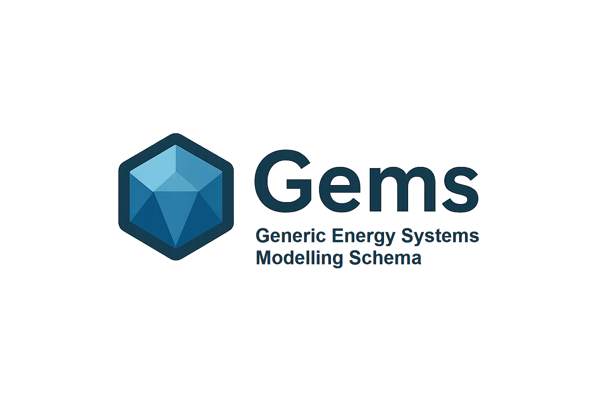

<div align="center">



# GemsPy

**A Python interpreter for [GEMS](https://gems-energy.readthedocs.io/en/latest/) — modelling and simulating complex energy systems under uncertainty.**

[](https://github.com/AntaresSimulatorTeam/GemsPy/actions/workflows/ci.yml)
[](https://pypi.org/project/gemspy/)
[](https://pypi.org/project/gemspy/)
[](https://opensource.org/licenses/MPL-2.0)
[](https://gemspy.readthedocs.io/en/latest/)
[](https://github.com/psf/black)

[📖 Documentation](https://gemspy.readthedocs.io/en/latest/) •
[🚀 Getting Started](https://gemspy.readthedocs.io/en/latest/getting-started/) •
[🧩 GEMS framework](https://gems-energy.readthedocs.io/en/latest/) •
[💬 Issues](https://github.com/AntaresSimulatorTeam/GemsPy/issues)

</div>

---

## ✨ Why GemsPy

- 🧠 **No-code modelling** — describe energy-system components in a high-level language close to mathematical syntax, no Python required.
- 🗂️ **YAML-first workflow** — read, edit and create case studies as plain YAML files, or build them programmatically from Python.
- ⚙️ **Solver-agnostic** — generates optimisation problems and delegates to off-the-shelf solvers.
- 🎲 **Built for uncertainty** — first-class support for time-dependent and scenario-dependent data.
- 🧪 **Production-grade Python API** — self-supporting, fully tested package, independent from any simulator binary.

---

## 📦 Installation

```bash
pip install gemspy
```

## 🚀 Quick start

Given a study directory containing your `library.yml`, `system.yml` and timeseries files (see the [Getting started guide](https://gemspy.readthedocs.io/en/latest/getting-started/)):

```python
from pathlib import Path
from gems.study.folder import load_study
from gems.session import SimulationSession
from gems.optim_config import load_optim_config

study = load_study(Path("my_study"))
optim_config = load_optim_config(Path("my_study/input/optim-config.yml"))

session = SimulationSession(study=study, optim_config=optim_config)
results = session.run()
```

Or, in a single call:

```python
from pathlib import Path
from gems.study.runner import run_study

run_study(Path("my_study"))
```

---

##  The GEMS framework

[GEMS](https://gems-energy.readthedocs.io/en/latest/) introduces a novel approach to modelling and simulating energy systems, centred around a simple principle: **getting models out of the code**.

To develop and test new models of energy-system components, writing software code should not be a prerequisite. This is where **GEMS** excels, offering users a *no-code* modelling experience with unparalleled versatility.

The framework consists of two pieces:

- 📝 a **high-level modelling language**, close to mathematical syntax;
- 🗃️ a **data structure** for describing energy systems.

## 🐍 The GemsPy package

`GemsPy` ships a generic interpreter of **GEMS** capable of generating optimisation problems from any study case that adheres to the modelling language syntax, then solving them with off-the-shelf solvers.

The Python API lets you:

- read case studies stored in YAML format,
- modify existing studies,
- or create new ones from scratch by scripting.

The [Getting started](https://gemspy.readthedocs.io/en/latest/getting-started/) page of the online documentation walks you through the **GEMS** input file format and the basics of the GemsPy API.

---

## 🔗 Link with Antares Simulator

GemsPy is part of the **Antares** project, but its implementation is completely independent from the [Antares Simulator](https://antares-simulator.readthedocs.io/en/latest/user-guide/modeler/01-overview-modeler/) software. It was initially designed to prototype the next features of Antares, but its structuring and development practices have produced a high-quality, self-supporting codebase. It is now maintained to bring the flexibility of the GEMS modelling language and interpreter to Python users, and to keep exploring its potential.

---

## 📚 Documentation

Full documentation is hosted on Read the Docs: **[gemspy.readthedocs.io](https://gemspy.readthedocs.io/en/latest/)**.

## 📄 License

Distributed under the **Mozilla Public License 2.0**. See [LICENSE](LICENSE) for details.
